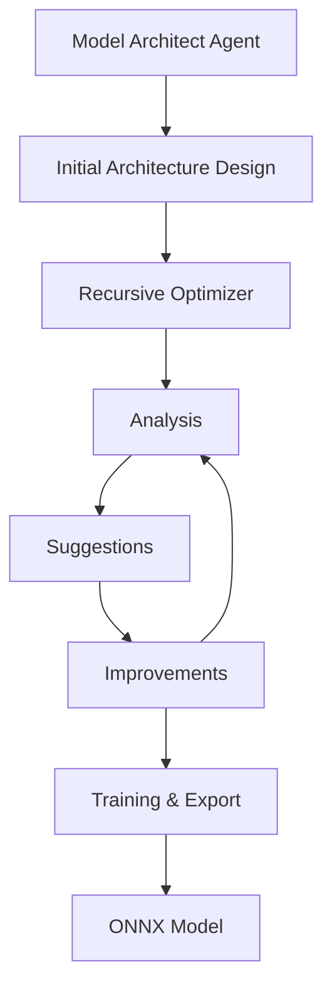

# Model Architect Agent

An autonomous agent for designing and optimizing neural network architectures. The agent uses the ReACT (Reasoning + Acting) pattern and leverages the OpenRouter API to interact with Claude 3.5 Sonnet for architecture optimization.

## Features

- Automated neural network architecture design
- Recursive optimization with real-time metrics
- Support for multiple tasks (image classification, text classification)
- ONNX export for cross-platform compatibility
- Quantization support for model optimization
- Detailed logging and analysis
- Support for both js-pytorch and mock implementations
- Automated model training and export workflow

## Installation

1. Install Deno:
```bash
curl -fsSL https://deno.land/x/install/install.sh | sh
```

2. Set up environment variables:
```bash
export OPENROUTER_API_KEY=your-api-key
```

3. (Optional) Install js-pytorch for actual model training:
```bash
npm install js-pytorch
```

## Usage

### Command Line Interface

The agent can be used in either auto or interactive mode:

```bash
# Optimize image classification model
deno task optimize:auto:image

# Optimize text classification model
deno task optimize:auto:text

# Interactive mode for image classification
deno task optimize:interactive:image

# Interactive mode for text classification
deno task optimize:interactive:text
```

### Training and Export

The agent supports both mock training (for testing) and actual training with js-pytorch:

```bash
# Run with mock implementation (for testing)
USE_MOCK=true deno task train examples/train-and-export.ts

# Run with actual js-pytorch
deno task train examples/train-and-export.ts
```

### Optimization Constraints

You can customize the optimization process by modifying the constraints in `examples/optimize-cnn.ts`:

```typescript
const constraints: OptimizationConstraints = {
  maxParameters: 10_000_000,
  maxMemory: 1000,  // MB
  minAccuracy: 0.95,
  maxLatency: 50,   // ms
  minThroughput: 100,  // samples/sec
  framework: "pytorch",
  quantization: {
    precision: "fp16",
    calibrationDataset: "validation"
  },
  // ... more constraints
};
```

### Output

The agent generates the following outputs in the `models/` directory:

```
models/
  └── task-name/
      ├── model.onnx           # ONNX model file
      ├── metadata.json       # Model metadata and metrics
      ├── README.md           # Usage instructions
      └── conversion.log      # ONNX conversion log
```

## Architecture

The Model Architect Agent follows a modular design:



### Components

- **Base Agent**: Provides core functionality and interface
- **Autonomous Agent**: Implements automated optimization
- **Recursive Optimizer**: Performs iterative improvements
- **Training Module**: Handles model training with js-pytorch
- **ONNX Export**: Handles model conversion and export

## Development

### Project Structure

```
src/
  ├── autonomous.ts       # Autonomous agent implementation
  ├── base.ts            # Base agent class
  ├── interactive.ts     # Interactive agent implementation
  ├── optimize/          # Optimization components
  ├── tools/            # Agent tools
  ├── types/            # TypeScript type definitions
  └── utils/            # Utility functions and mock implementations
```

### Mock Implementation

The agent includes a mock implementation for testing purposes:
- Simulates PyTorch functionality
- Supports all common layer types
- Generates mock training metrics
- Creates valid ONNX model structure

### Adding New Tasks

1. Update `types/index.ts` with task-specific types
2. Add task implementation in `autonomous.ts`
3. Create example in `examples/` directory
4. Update documentation

### Running Tests

```bash
deno test --allow-net --allow-env
```

## Contributing

1. Fork the repository
2. Create a feature branch
3. Make your changes
4. Submit a pull request

## License

MIT License - see LICENSE file for details
